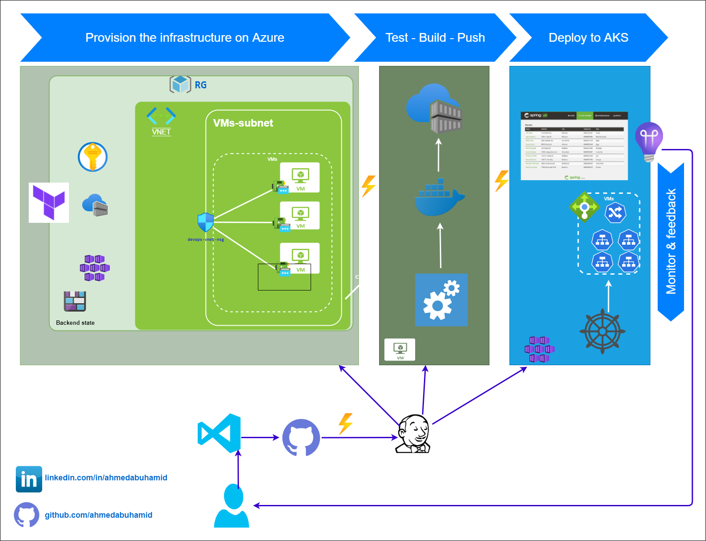

# Provision Azure infrastructure using Terraform and Jenkins 
---

* This repository is made to :
  * Help you to start with Terraform and Jenkins.
  * help you to test services on azure by quickly and easily provisioning the needed infrastructure.
  * destroy all provisioned infra with one command to avoid any extra charges.
  * if you need to automate full CI/CD from the building, testing, publishing artifacts, provision the infra, and deploy the artifacts to it.

# The plan for this repository:
---
The work and update to this repository will be done incrementally, we will start simple and add more features, automation, hardening, and best practices so it will be easier to demonstrate the concept.

# The repository structure
---
* The repository will be having versioned folders :
  *  the version will be incremented after addition or improvement is done.
  * More details will be added to the readme files or each module/folder.
  * I will add very detailed documentation to the wiki.

this can be used as a part of the below workflow, which I will be implementing in separate repositories.

