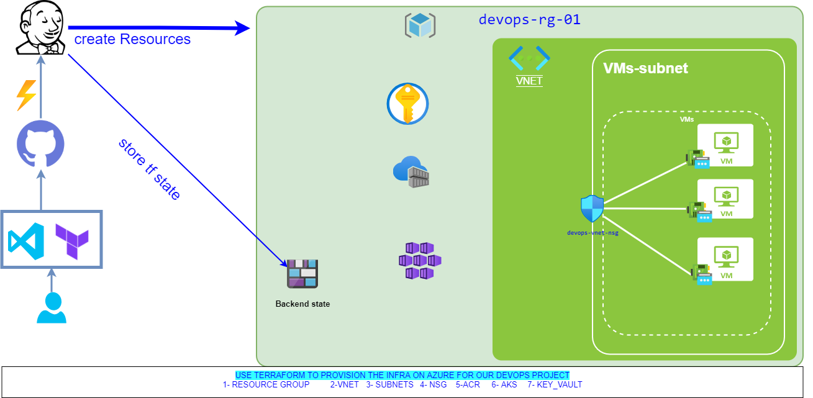

# Provision Azure infrastructure using Terraform and Jenkins - V1.0.0
* pre-requesits:
  * Jenkins server, you can see my installed plugins in [Jenkins-plugins.txt](./Jenkins-plugins.txt).
  * Terraform for local testing.
  * Azure subscription.
  * your favorite IDE, I use VS code.
  * public/ private ssh key pair.
* Provisioned infrastructure:
  * 3 Ubuntu 16.04 servers (you can change as per your need)
  * 1 VNet / 2 subnets
  * 3 NICs/ 3 public IPs / 3 public_ip_dns (you can access the apps with name instead of IP)
  * NSG , only ssh is allowed
  * 1 azure key vault
  * 1 ACR / 1 AKS

  
* Testing locally:
  * clone the repo to your local folder and change the directory to it.
  * use the provided [vars-for-local.txt](./vars-for-local.txt) to create terraform.tfvars (shouldn't be committed to git as it has sensitive data).
  * use the below commands to start:
    ```
    terraform init   
    terraform plan
    terraform apply
    terraform destroy
    ```
* Testing with Jenkins:
    * commit the code to your git repo, you can clone mine.
    * user Jenkins credentials plugin to add your service principle authentication info.
    * create a pipeline with the git repo that will detect the Jenkinfile and start executing its steps.
  
# very detailed guide with screenshots and external resources will be added to the wiki.

